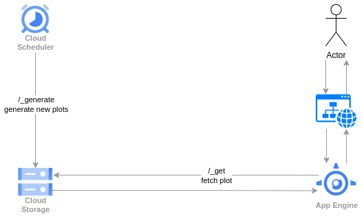

## Not That Movie

[](https://github.com/lajanki/not_that_movie/actions/workflows/deploy.yml)

A Python Flask webapp for poorly translated movie plots. Deployed to Google App Engine.

> In Port Royal, Jack will be hanged for Piraci. Elizabeth redirects Norruring's attention as he tries to save,
> but Jack and Will is surrounded by Lizabeth.
> Governor Svann Padar comes and gives his blessing and gives his blessing and gives his blessing and gives his
> blessing to bless his blessings to bless her blessing.
>
> _Pirates: The Caribbean_

The project is managed with [uv](https://docs.astral.sh/uv/).


### Data flow
Movie plots are pregenerated at regular intervals by translating existing plots from Wikipedia via 1-2
intermediary languages back to English using Google Translate. Generated plots are stored to a public Cloud Storage bucket
to be read by the frontend.

Additionally, a poster image is generated via OpenAI's [DALL-E](https://openai.com/dall-e-2) model.




### Running locally
The project can be run over localhost with Flask development server.

With `uv` installed, first start the server with
```bash
uv run flask --app app.views:app run --debug
```
Then, to generate a set of _2_ movie translations, send a request with
```bash
curl -H "X-Appengine-Cron: 1" "http://127.0.0.1:5000/_generate?type=MOVIE&batch_size=2"
```
Resulting plots are stored to the _dev_ bucket.

Similarly, to generate translations for people:
```bash
curl -H "X-Appengine-Cron: 1" "http://127.0.0.1:5000/_generate?type=PERSON&batch_size=2"
```

> [!NOTE]  
> The Google Translate API is rate limited. Each generation request includes multiple sections to translate. Therefore, is better to make several generation calls with moderate `batch_size` over a timeframe than to use a large batch size.

> [!NOTE]  
> When ran locally, the poster image generation is skipped in order to save DALL-E API tokens. A template image will be used instead. 

### Unit tests
Unit tests for the Python backend can be run with
```bash
uv run pytest
```

### Caveats
The project uses a third party Google Translate library: [googletrans](https://github.com/ssut/py-googletrans). It is not an official Google product and is not guaranteed to be stable. Translations calls may fail with indirect error messages, this is likely related to API rate limits.

Similarly, Wikipedia movie plot content is web scraped using the page content endpoint of the API [https://en.wikipedia.org/api/rest_v1/](https://en.wikipedia.org/api/rest_v1/).
This relies on certain html elements like `section > h2#Plot` being available on the page and as such may break on major changes on Wikipedia's underlying page template. 

### Adding new source movies
The base set of movies to choose for the translations is definied as text files in `data/`. These include:
 * recent popular movies
 * best selling movies in the USA
 * IMDB top 250 movies

On each translation request, a random subset of movies is selected but more weight is given to the more recent and top selling ones.

New source lists can be added here, but a weight needs to be defined in [data/weight_config.json](data/weight_config.json) in order for it to be considered for
the rotation.

Movie names need to be in the format they are in the url of the corresponding Wikipedia article, ie. for the 1991 Disney _Beauty and the Beast_ use `Beauty_and_the_Beast_(1991_film)` as in https://en.wikipedia.org/wiki/Beauty_and_the_Beast_(1991_film)

### Deploy to App Engine
A GitHub Actions workflow deploys the project to App Engine on push to the main branch. Only the web service component is deployed. Scheduling for the content parsing endpoints is not included in this repository as App Engine does not support managing service specific schedules.