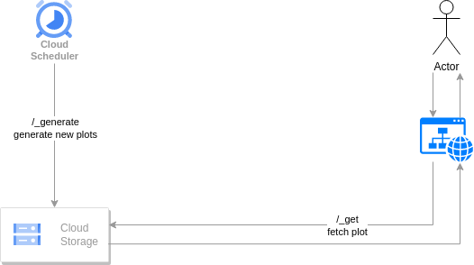

## Not That Movie

[](https://github.com/lajanki/not_that_movie/actions/workflows/deploy.yml)

A Python Flask webapp for poorly translated movie plots. Deployed to Google App Engine.

> In Port Royal, Jack will be hanged for Piraci. Elizabeth redirects Norruring's attention as he tries to save,
> but Jack and Will is surrounded by Lizabeth.
> Governor Svann Padar comes and gives his blessing and gives his blessing and gives his blessing and gives his
> blessing to bless his blessings to bless her blessing.
>
> _Pirates: The Caribbean_


### Data flow
Movie plots are pregenerated at regular intervals by translating existing plots from Wikipedia via 1-2
intermediary languages back to English using Google Translate. Generated plots are stored to a public Cloud Storage bucket
to be read by the frontend.

Additioanlly a poster image is generated via OpenAI's [DALL-E](https://openai.com/dall-e-2) model.



### Cloud Storage setup
The script `setup_gcs.sh` can be used to setup a **public** Cloud Storage bucket for storing generated plots.
It also adds a 30 day expiration lifecycle rule to allow slowly renwing generated files. Respectively, the
number of daily generated plots is set as a scheduled task in `schedule.yaml` (this is a template file,
App Engine actually requires the file to be called _cron.yaml_. The final config is not covered here).

### Unit tests
Unit tests for the Python backend can be run with
```
pytest
```

### Running locally
The project can be run over localhost with Flask development server.
First start the server with
```
python main.py
```
Then, to generate a set of _2_ translations, send a request with
```
curl -H "X-Appengine-Cron: 1" http://127.0.0.1:5000/_generate?batch_size=2
```
Resulting plots are stored to the _dev_ bucket.

> **NOTE**: In order to save DALL-E API tokens, this will use a template poster image instead of performing an API call. 

### Caveats
* The project uses a free library for Google Translate: [googletrans](https://github.com/ssut/py-googletrans). It is not an
official Google product and not guaranteed to be stable.
* Similarly, Wikipedia movie plot content is web scraped using the page content endpoint of the API [https://en.wikipedia.org/api/rest_v1/](https://en.wikipedia.org/api/rest_v1/).
This relies on certain html elements like `section > h2#Plot` being available on the page and as such may break on major changes on Wikipedia's underlying page template. 

### Deploy to App Engine
A GitHub Actions workflow deploys the project to App Engine on push to main branch.